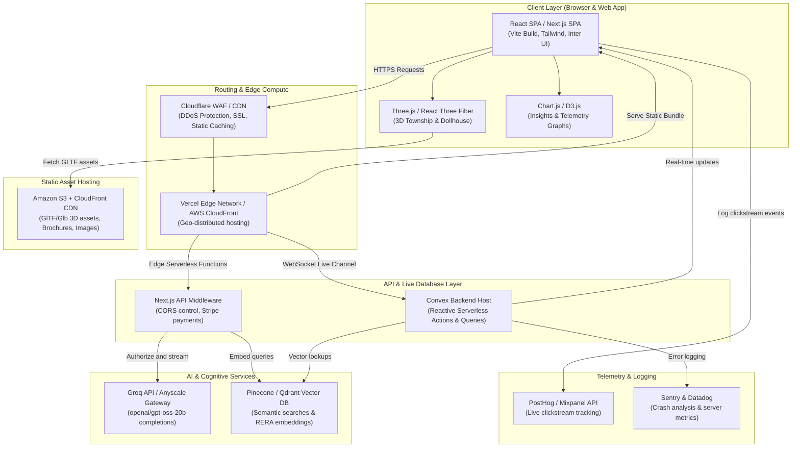

# Shivalik AI Platform - Production Architecture & Tech Stack

This document defines the production-grade system architecture and software tech stack required to scale the **Shivalik AI Property Experience Platform** to support thousands of concurrent buyers, agent portals, and real-time AI simulations.

---

## 1. System Architecture Diagram

The diagram below outlines the data flows and integrations between the client browser, edge routing networks, real-time database, vector search engines, and LLM APIs.

---

## 2. Production Tech Stack Components

| Layer | Recommended Technology | Purpose in Shivalik Platform | Alternative Options |
| :--- | :--- | :--- | :--- |
| **Frontend Framework** | **Next.js (React)** | Serves as the core UI container. Supports Server-Side Rendering (SSR) for SEO-optimized landing pages and static exports for client dashboard performance. | Vite React, Remix |
| **3D Rendering Engine** | **React Three Fiber (R3F) + Three.js** | Renders the interactive 3D township layouts and the interior dollhouse viewer natively in WebGL. | BabylonJS, PlayCanvas |
| **Interactive Graphing** | **Chart.js** | Powers the dynamic Graph Mode side-by-side with Copilot, drawing radar and cagr trends. | Recharts, D3.js |
| **Backend & Sync** | **Convex Backend** | Handles real-time active customer leads, payment schedules, and inventory tracking with automatic WebSocket updates. | Firebase, Supabase |
| **AI Inference Host** | **Groq Cloud** | Streams completions using Llama-3 or GPT-OSS models with extreme speed, low latency, and low token costs. | Together AI, OpenAI |
| **Vector DB (semantic search)** | **Qdrant Cloud / Pinecone** | Indexes and queries text strings from legal PDFs, builder catalogs, RERA approvals, and neighborhood density maps. | PGVector (Supabase) |
| **Storage Solution** | **AWS S3 + CloudFront CDN** | Delivers massive 3D models (GLTF/GLB formats), brochure PDFs, and images from regional endpoints. | Cloudflare R2 |
| **Observability & Analytics** | **PostHog + Sentry** | Log real-time buyer engagement telemetry metrics, telemetry loops, and crash records. | Mixpanel, Datadog |

---

## 3. Production Considerations & Scaling Rules

### WebGL Asset Optimization
- **Rule**: Never load uncompressed raw 3D assets on the browser.
- **Solution**: Use **Draco compression** (`gltf-pipeline`) to compress 3D models up to **80% smaller**, and use level-of-detail (LOD) geometries to load simpler meshes when viewing at a distance in the Township.

### Secure LLM API Key Management
- **Rule**: Never expose the Groq/OpenAI keys (`VITE_GROQ_API_KEY`) on the client side in a production release.
- **Solution**: Proxy AI streaming queries through an edge middleware route (e.g. Next.js `/api/chat` router) with authorization checks, keeping keys safely stored in the backend environment.

### Vector Search Embeddings Pipeline
- **Rule**: Keep files synced with vector databases automatically.
- **Solution**: Set up a serverless background worker (e.g. Convex scheduled actions or AWS Lambda) that runs every time a PDF or document is uploaded to update the Pinecone namespace.
